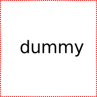

I'm a dummy blog entry! I'm just here to test formatting

<!--more-->

## Basic Markdown
### Emphasizing
Lorem ipsum dolor sit amet, consectetur adipiscing elit. Donec auctor varius est non pellentesque. Morbi laoreet quam in metus imperdiet vestibulum. Ut volutpat sit amet nisi vel malesuada. Aenean *sodales* lorem _turpis_. Proin sollicitudin bibendum dolor eget accumsan. Vivamus **vulputate** fringilla __tristique__. Sed leo nulla, faucibus feugiat arcu ac, tincidunt faucibus felis. Integer bibendum ligula vestibulum porttitor sagittis.

### Lists
Nam luctus est justo, ultrices facilisis tellus pharetra eget. Donec id quam congue mi semper vestibulum at id lectus. Integer facilisis malesuada tortor at porta. Vivamus non enim et turpis malesuada finibus. Donec elementum ante feugiat, tristique lorem convallis, pulvinar quam.

  - A
    - A
      1. A
          - A
          - B
      2. B
      3. C
      4. D
    - B
  - B
  - C

Cras dictum tristique venenatis. Donec mattis iaculis velit imperdiet iaculis. Donec mattis porta pretium. Donec ut pharetra velit, sagittis gravida nulla. Duis tempus libero nec enim bibendum vehicula. Mauris accumsan pellentesque lorem congue ultrices. Donec at justo congue, bibendum libero id, mollis lectus. Donec vitae odio vitae orci dictum blandit. Etiam non urna sagittis velit porttitor facilisis. Nulla rutrum, elit vel lobortis finibus, ipsum enim venenatis ipsum, quis condimentum metus nunc eget elit.

### Links
Pellentesque at turpis [dictum](#), elementum nisl id, pellentesque ante. Vestibulum ornare ligula a eros rhoncus, ac euismod turpis interdum. Donec aliquam iaculis viverra. In pulvinar, diam a pharetra posuere, libero orci tristique lorem, sit amet hendrerit felis velit [scelerisque odio](#). Praesent sit amet tellus condimentum, semper ante ut, suscipit diam. Cras eu ipsum vitae dolor tempus convallis. Pellentesque eget elit velit. Nulla pulvinar lectus eu ante tempor, eu volutpat lacus malesuada. Nam efficitur at lacus ut elementum.

### Images
Aliquam dui mauris, aliquet fringilla hendrerit at, tempor sodales lorem. Maecenas tempus metus quis nulla lobortis faucibus. Proin lobortis diam arcu, eget porttitor enim bibendum in. Quisque sit amet felis non purus consequat dignissim.



Phasellus eget iaculis leo. Donec rhoncus risus non lectus dignissim luctus. Nulla nec interdum purus. Phasellus vel consequat magna. Etiam rhoncus eleifend purus, ut luctus dolor finibus eget. Aliquam vitae dui ut urna convallis pretium. Nunc luctus tempor arcu, eget tristique eros dignissim id.

### Code and syntax highlighting
Quisque at erat ac arcu euismod interdum. Fusce elementum ex vitae purus malesuada, id feugiat magna tincidunt. Nam id sapien pharetra, consequat massa ut, pharetra turpis. Integer vel libero ut `turpis sagittis vulputate` vitae eu erat. Duis feugiat, lectus vel imperdiet sagittis, turpis magna rhoncus ligula, quis pharetra leo nulla a nibh. Matlab:
```matlab
import casadi.*
for i = 1:1:2
  disp(i);
end
```
Python:
```python
from casadi import *
for i in range(0, 1):
  print i
```
Quisque feugiat eros sit amet nibh pretium feugiat. Ut et nisl at nisi accumsan ullamcorper. Cras quis libero dignissim libero venenatis ultricies. Ut commodo enim vel mi aliquam, id fermentum massa mollis.

### Tables
Ut tempus lacinia ligula, id mollis elit. Cras vestibulum est ac nisl fermentum, in convallis nulla sollicitudin. Fusce ut tincidunt turpis, at condimentum nisi. Vestibulum ultrices ante nulla, ac finibus neque volutpat a. Pellentesque nec sem non enim dictum mattis.

| Tables        | Are           | Cool  |
| ------------- |:-------------:| -----:|
| col 3 is      | right-aligned | $1600 |
| col 2 is      | centered      |   $12 |
| zebra stripes | are neat      |    $1 |

Quisque at erat ac arcu euismod interdum. Fusce elementum ex vitae purus malesuada, id feugiat magna tincidunt. Nam id sapien pharetra, consequat massa ut, pharetra turpis. Integer vel libero ut turpis sagittis vulputate vitae eu erat. Duis feugiat, lectus vel imperdiet sagittis, turpis magna rhoncus ligula, quis pharetra leo nulla a nibh. Quisque feugiat eros sit amet nibh pretium feugiat. Ut et nisl at nisi accumsan ullamcorper. Cras quis libero dignissim libero venenatis ultricies. Ut commodo enim vel mi aliquam, id fermentum massa mollis.

### Blockquotes
Nam luctus est justo, ultrices facilisis tellus pharetra eget. Donec id quam congue mi semper vestibulum at id lectus. Integer facilisis malesuada tortor at porta. Vivamus non enim et turpis malesuada finibus. Donec elementum ante feugiat, tristique lorem convallis, pulvinar quam.

> Cras dictum tristique venenatis. Donec mattis iaculis velit imperdiet iaculis.

Multiliner...

> Cras dictum tristique venenatis. Donec mattis iaculis velit imperdiet iaculis. Donec mattis porta pretium. Donec ut pharetra velit, sagittis gravida nulla. Nulla rutrum, elit vel lobortis finibus, ipsum enim venenatis ipsum, quis condimentum metus nunc eget elit. Duis feugiat, lectus vel imperdiet sagittis, turpis magna rhoncus ligula, quis pharetra leo nulla a nibh.

Duis tempus libero nec enim bibendum vehicula. Mauris accumsan pellentesque lorem congue ultrices. Donec at justo congue, bibendum libero id, mollis lectus. Donec vitae odio vitae orci dictum blandit. Etiam non urna sagittis velit porttitor facilisis. Nulla rutrum, elit vel lobortis finibus, ipsum enim venenatis ipsum, quis condimentum metus nunc eget elit.

### Inline HTML
Inline HTML is supported ...
<div style="width: 20px; height: 20px; background-color: #ff0000; display: block; margin-left: 50px;">&nbsp;</div>

... just in case things get complicated.


### Horizontal rule
Three or more hyphens `---`, asterisks `***` or underscores `___` result in a horizontal rule like this:

---

That's all.

## Mathematics
Let's check if various math environments are correctly rendered...
Inline math with `$ a = b $` looks like this $ a = b $. Double the cash, `$$ a = b, $$`, and you get some blocked math view like $$ a = b, $$ which is already nice. But also more complex environments are supported, e.g.
```latex
\begin{aligned}
  & \underset{x}{\text{minimize}} & & f_0(x) \newline
  & \text{subject to} & & f_i(x) \leq b_i, \; i = 1, \ldots, m.
\end{aligned}
```
results in

\begin{aligned}
  & \underset{x}{\text{minimize}} & & f_0(x) \newline
  & \text{subject to} & & f_i(x) \leq b_i, \; i = 1, \ldots, m.
\end{aligned}

Awesome, no? That's all folks.

## Multisnip
Especially for CasADi we introduce a so-called multisnip shortcode

<div class="multisnip"><pre><code language="Cpp">#include <casadi/casadi.hpp>

using namespace casadi;
using namespace std;

/**
Solve the Rosenbrock problem, formulated as the NLP:
minimize     x^2 + 100*z^2
subject to   z+(1-x)^2-y == 0
Joel Andersson, 2015-2016
*/

int main(){

  // Declare variables
  SX x = SX::sym("x");
  SX y = SX::sym("y");
  SX z = SX::sym("z");

  // Formulate the NLP
  SX f = pow(x,2) + 100*pow(z,2);
  SX g = z + pow(1-x, 2) - y;
  SXDict nlp = {{"x", SX::vertcat({x,y,z})},
                {"f", f},
                {"g", g}};

  // Create an NLP solver
  Function solver = nlpsol("solver", "ipopt", nlp);

  // Solve the Rosenbrock problem
  DMDict arg;
  arg["x0"] = vector<double>{2.5,3.0,0.75};
  arg["lbg"] = arg["ubg"] = 0;
  DMDict res = solver(arg);

  //  Print solution
  cout << "Optimal cost:                     " << double(res.at("f")) << endl;
  cout << "Primal solution:                  " << vector<double>(res.at("x")) << endl;
  cout << "Dual solution (simple bounds):    " << vector<double>(res.at("lam_x")) << endl;
  cout << "Dual solution (nonlinear bounds): " << vector<double>(res.at("lam_g")) << endl;

  return 0;
}</code><code language="Matlab">% Load CasADi
import casadi.*

% Create NLP: Solve the Rosenbrock problem:
%     minimize    x^2 + 100*z^2
%     subject to  z + (1-x)^2 - y == 0
x = SX.sym('x');
y = SX.sym('y');
z = SX.sym('z');
v = [x;y;z];
f = x^2 + 100*z^2;
g = z + (1-x)^2 - y;
nlp = struct('x', v, 'f', f', 'g', g);

% Create IPOPT solver object
solver = nlpsol('solver', 'ipopt', nlp);

% Solve the NLP
res = solver('x0' , [2.5 3.0 0.75],... % solution guess
             'lbx', -inf,...           % lower bound on x
             'ubx',  inf,...           % upper bound on x
             'lbg',    0,...           % lower bound on g
             'ubg',    0);             % upper bound on g

% Print the solution
f_opt = full(res.f)          % >> 0
x_opt = full(res.x)          % >> [0; 1; 0]
lam_x_opt = full(res.lam_x)  % >> [0; 0; 0]
lam_g_opt = full(res.lam_g)  % >> 0</code><code language="Python">from casadi import *

"""
Solve the Rosenbrock problem, formulated as the NLP:
minimize     x^2 + 100*z^2
subject to   z+(1-x)^2-y == 0
Joel Andersson, 2015
"""

# Declare variables
x = SX.sym("x")
y = SX.sym("y")
z = SX.sym("z")

# Formulate the NLP
f = x**2 + 100*z**2
g = z + (1-x)**2 - y
nlp = {'x':vertcat(x,y,z), 'f':f, 'g':g}

# Create an NLP solver
solver = nlpsol("solver", "ipopt", nlp)

# Solve the Rosenbrock problem
res = solver(x0  = [2.5,3.0,0.75],
             ubg = 0,
             lbg = 0)

# Print solution
print()
print("%50s " % "Optimal cost:", res["f"])
print("%50s " % "Primal solution:", res["x"])
print("%50s " % "Dual solution (simple bounds):", res["lam_x"])
print("%50s " % "Dual solution (nonlinear bounds):", res["lam_g"])</code></pre></div>
